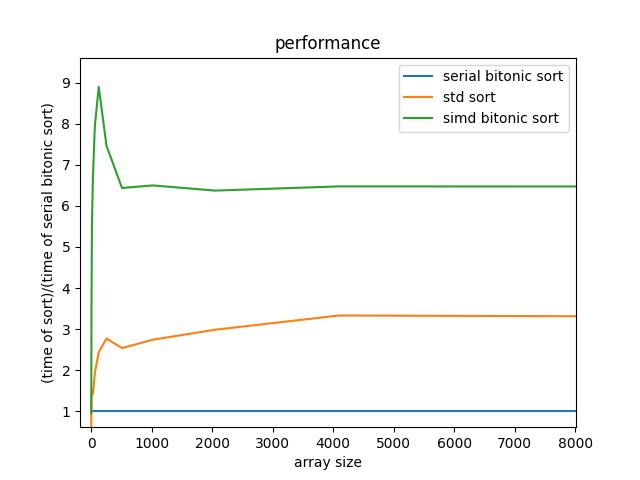
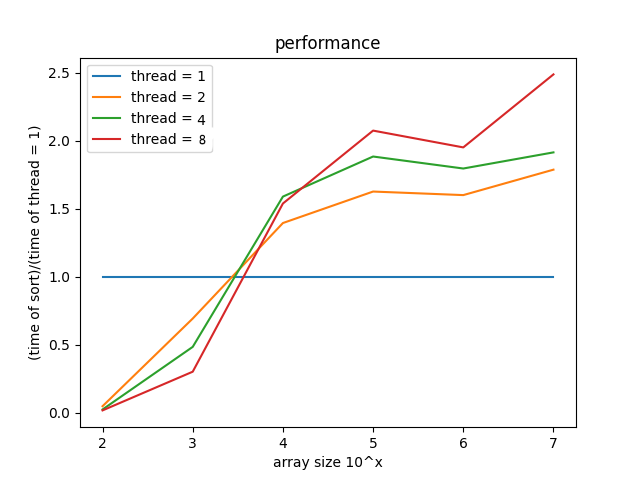

# parallel-sort

目标是利用向量寄存器优化bitonic sort

初始版本改编自[Geolm/simd_bitonic: Bitonic sort using simd (avx/neon) instructions (github.com)](https://github.com/Geolm/simd_bitonic)。

测试了最初搬版本的性能：

通过openmp使用了不同的线程：

https://www.cnblogs.com/walker-lin/p/11354687.html

